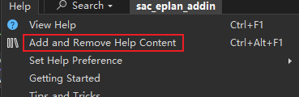
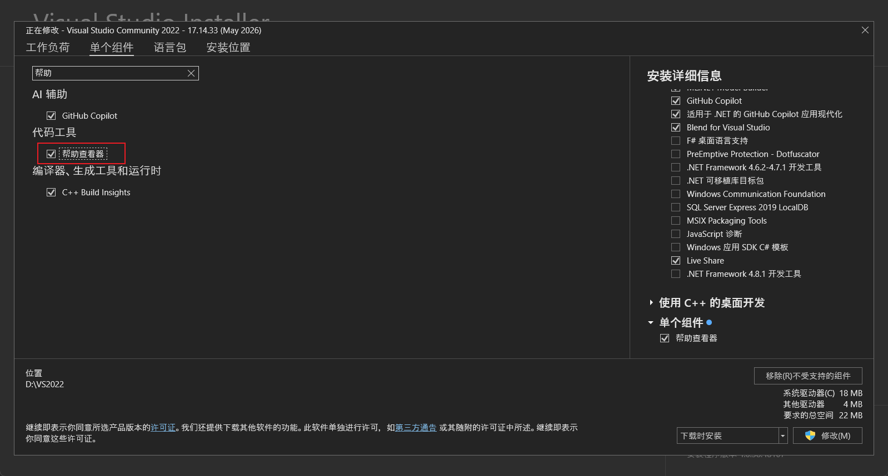
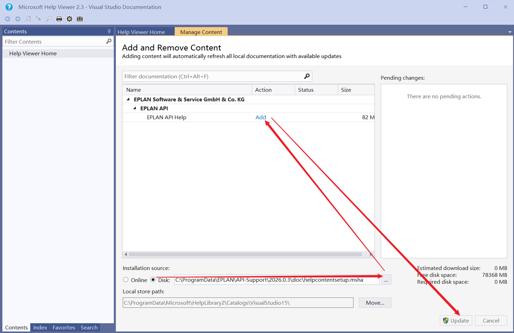
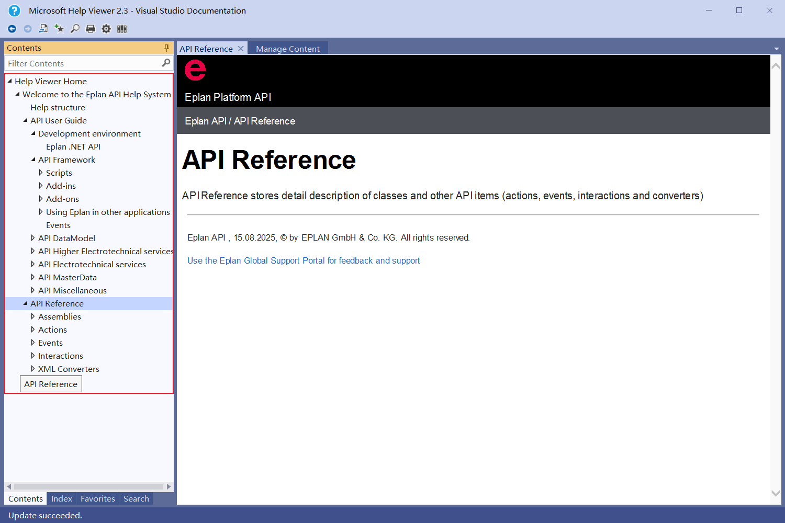
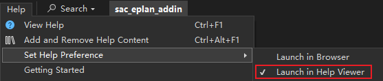
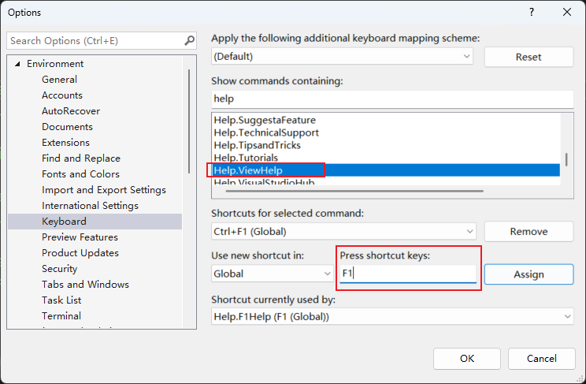

前期准备

下载并安装 Eplan 和 visual studio，本教程基于Eplan 2026 和 visual studio 2022 community

任何二次开发项目都需要

[在线API帮助文档](https://www.eplan.help/en-us/Infoportal/Content/api/2026/index.html)

*安装帮助查看器*

> C:\ProgramData\EPLAN\API-Support\2026.0.3\doc\helpcontentsetup.msha

*安装完成后*

*设置默认启动帮助查看器*

View Help默认 Ctrl+F1，为了更加方便调用，我们把它改为 F1。

*更改快捷键设置*

## 参考资料

- [eplan.help](https://www.eplan.help/en-us/Infoportal/Content/api/2026/Help%20structure.html)