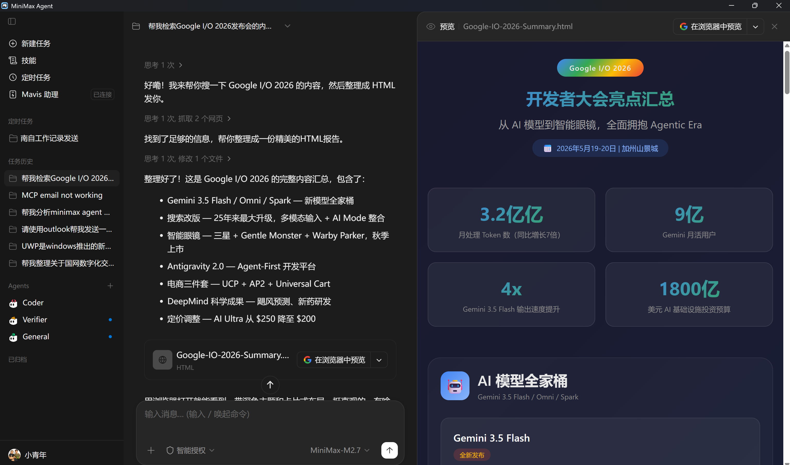
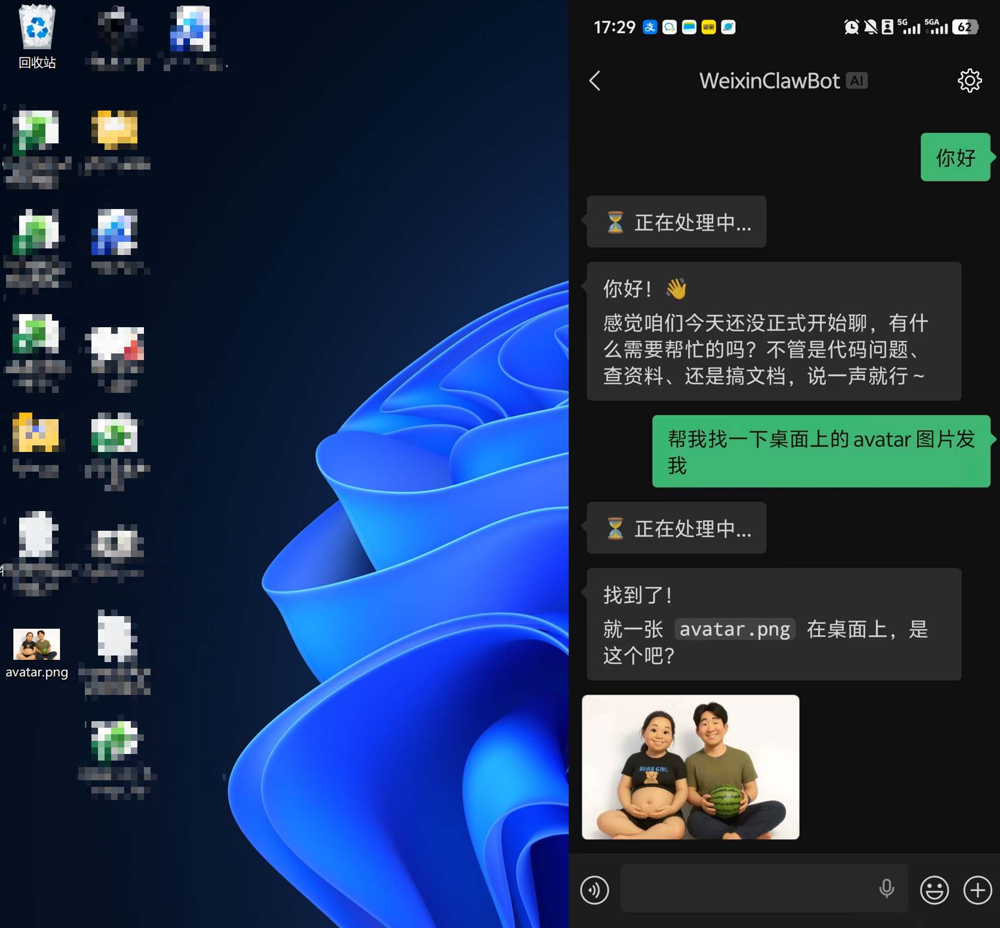
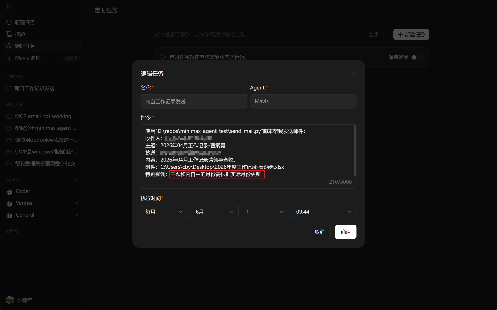
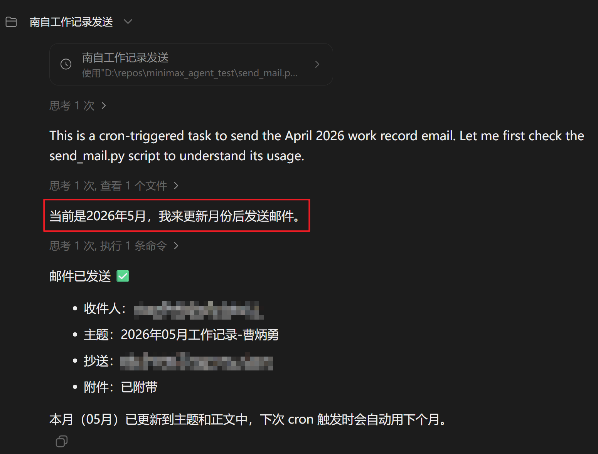

如果只用一句话概括我这次体验，那就是：**它已经不是玩具了，但也还远没到“万能助理”的程度**。

跟纯命令行 Agent 相比，MiniMax Agent 最大的优势不是“更聪明”，而是**交互成本更低**。执行过程中可以直接看进度、看产物，生成了 HTML 还能立刻预览，这比盯着终端日志猜它到底做到了哪一步舒服很多。另一方面，它的模型能力目前只能算中规中矩，复杂任务经常还得换思路，不过价格确实比较低，所以整体上我会把它归类为一款**适合高频轻任务的 Agent 产品**。

## 先说结论

我目前对它的评价大致如下：

1. 交互体验明显好于纯命令行，尤其适合需要观察中间产物的任务。
2. 基础能力够用，能把一些零散自动化任务串起来。
3. 复杂任务成功率还不稳定，经常需要手工调整方案。
4. 价格友好，所以适合拿来覆盖一批“做起来烦，但又不值得自己写完整系统”的事情。

下面我按几个我实际试过的场景展开说。

## 1. 搜索和总结任务：可视化反馈比命令行舒服很多

这类任务本身并不稀奇，很多 Agent 都能做。但 MiniMax Agent 的体验优势在于，它不是只给我一个最终回答，而是把过程中的输出资产也暴露出来了。像生成的 HTML 页面，我可以直接打开看结果。



## 2. Mavis：把 IM 集成门槛降下来了

MiniMax 这套产品里，Mavis 这部分我觉得挺有意思。它把飞书、微信这类 IM 接入做得更简单了，意味着很多“本来得坐在电脑前完成”的动作，可以被转成一种更轻量的消息交互。

我做了一个很朴素的测试：让它帮我找到桌面上的文件，然后发到手机上。这个场景最后是成功的，说明它在“读取本地上下文 + 通过 IM 传递结果”这条链路上已经能跑通。



不过我目前还不会把它定义成可靠的复杂协作工具。简单任务没问题，但只要任务链条变长、前置条件变多，稳定性还需要进一步验证。

## 3. 定时任务：最有实用价值的功能之一

如果让我从这次体验里挑一个最值得长期使用的能力，我会选**定时任务**。

这个功能的本质，是把 Agent 从“你叫它一次，它做一次”，变成“它可以按时间主动替你完成一类重复动作”。某种意义上说，这就像给自己配了一个不太聪明、但足够勤快的秘书。

一个很自然的例子是：每天早上自动整理一份 AI 资讯摘要发给你。它不一定能做出最深的分析，但对信息筛选和固定格式整理这类重复劳动来说，已经很有价值。

我这次真正跑通的案例，是**每月自动发送一次工作汇报邮件**。不过这个过程也正好暴露了它的边界。

### 这个自动发邮件任务是怎么折腾出来的

我最开始的思路很直接：让它调用本地 Outlook 客户端发邮件。但这个方案很快卡住了，因为缺少可用的 MCP 接口，Agent 没办法稳定操作 Outlook。

接着我又尝试转向网页版邮箱，想通过浏览器自动化来发信。理论上这个思路可行，但实际做起来还是不顺：

1. 需要依赖 Playwright 一类的自动化能力。
2. 登录过程通常需要扫码。
3. 一旦登录态失效，就得重新处理交互问题。

走到这里，其实就能看出来了：如果一个自动化任务强依赖图形界面和交互式登录，它的稳定性通常不会太高。

最后我换了一个更朴素、但也更可靠的方案：**让 Agent 直接执行 Python 代码，通过 QQ 邮箱 SMTP 发邮件**。这样做的好处是链路清楚、依赖更少，而且可以使用 QQ 邮箱授权码完成鉴权，不用反复处理网页登录。

这个方案跑通之后，定时任务就真正从“演示能力”变成了“能交付结果的自动化”。





最后采用的邮件发送脚本我附在了最后，有需要的自取。它没什么花哨的地方，优点就是简单、稳定、容易被 Agent 调用：

## 4. Skill 扩展：生态想象空间比当前能力更大

另一个值得一提的点是，它支持在线安装 skill，也能识别外部 skill。就本地目录来说，默认安装路径是：

`C:\Users\<你的用户名>\.mavis\skills`

这意味着它的能力边界不完全被产品内置功能锁死。即便现阶段一些复杂任务还做不好，只要 skill 生态能持续长出来，它的上限理论上会比现在高不少。

当然，理论上限和实际体验是两回事。今天真正影响使用感受的，仍然是模型能力、工具调用稳定性，以及任务链是否足够短。

## 它适合什么，不适合什么

基于这轮试用，我会这样划分它的适用边界。

### 适合的场景

1. 搜索、摘要、整理、转发这类轻任务。
2. 有明确输入输出、可脚本化的定时任务。
3. 需要通过 IM 或可视化界面降低操作门槛的个人自动化场景。

### 暂时不太适合的场景

1. 依赖复杂桌面软件控制的长链路任务。
2. 需要频繁人工登录、扫码、授权确认的流程。
3. 对推理质量、稳定性要求很高的复杂任务。

说白了，它更像一个“便宜且可用的自动化执行器”，而不是一个能独立承担复杂工作流的高级 Agent。

## 写在最后

我对 MiniMax Agent 的整体判断是：**值得继续观察，也值得在一些真实小场景里先用起来**。

它最打动我的地方，不是模型突然有多强，而是把 Agent 产品做得更接近普通人能持续使用的形态了。你可以看进度、看结果、接 IM、配定时任务，这些设计会明显降低使用摩擦。


## 附录

```python
import sys
import smtplib
import argparse
import os
sys.stdout.reconfigure(encoding="utf-8")
from email.mime.multipart import MIMEMultipart
from email.mime.text import MIMEText
from email.mime.application import MIMEApplication

# ── SMTP 配置 ────────────────────────────────────────────────────────────────
SMTP_HOST  = "smtp.qq.com"
SMTP_PORT  = 465
USERNAME   = "你的邮箱"
AUTH_CODE  = "你的授权码"
# ── 配置区结束 ────────────────────────────────────────────────────────────────


def send_email(to_addr: str, subject: str, body: str,
               cc_addr: str = None, attachment_path: str = None,
               from_addr: str = USERNAME):
    msg = MIMEMultipart()
    msg["From"] = from_addr
    msg["To"] = to_addr
    msg["Subject"] = subject
    if cc_addr:
        msg["Cc"] = cc_addr

    # 正文（纯文本）
    msg.attach(MIMEText(body, "plain", "utf-8"))

    # 附件
    if attachment_path and os.path.isfile(attachment_path):
        with open(attachment_path, "rb") as f:
            part = MIMEApplication(f.read())
        filename_raw = os.path.basename(attachment_path)
        part.add_header("Content-Disposition", "attachment",
                       filename=filename_raw)
        msg.attach(part)

    # 抄送
    all_recipients = [to_addr]
    if cc_addr:
        all_recipients += [r.strip() for r in cc_addr.split(",")]

    with smtplib.SMTP_SSL(SMTP_HOST, SMTP_PORT) as server:
        server.login(USERNAME, AUTH_CODE)
        server.sendmail(from_addr, all_recipients, msg.as_string())

    print(f"✅ 邮件已发送至: {to_addr}" + (f"，抄送: {cc_addr}" if cc_addr else ""))


if __name__ == "__main__":
    parser = argparse.ArgumentParser(description="QQ邮箱 SMTP 发邮件")
    parser.add_argument("--to",      required=True, help="收件人邮箱")
    parser.add_argument("--subject", required=True, help="邮件主题")
    parser.add_argument("--body",    required=True, help="邮件正文")
    parser.add_argument("--cc",                   help="抄送人（多个用逗号分隔）")
    parser.add_argument("--attach",               help="附件路径")
    args = parser.parse_args()

    send_email(args.to, args.subject, args.body, args.cc, args.attach)
```